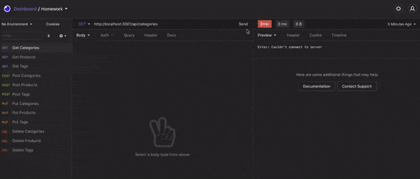

# ORM E-Commerce Backend

## Description

The purpose of this application is to use RESTful APIs such as GET, POST, PUT, and DELETE requests for the backend of an e-commerce store.

I used the following npm packages to build this application:
* dotenv
* mysql2
* sequelize
* express

## Details

### Starting The App

1) Edit the the name of the .envEXAMPLE file to .env, and inser your SQL username and password. 

2) Copy the code from the schema.sql file and run it in MySQLWorkbench (or another comparable program).

2) Run the following command in your terminal to execute the seeds:
    
        node seeds/

2) Run the following command in your terminal to launch the server:
    
        node server.js

### Using The App

Using Insomia, or a similar API program, use the following base URLS for your GET and POST routes:

* http://localhost:3001/api/categories
* http://localhost:3001/api/products
* http://localhost:3001/api/tags

To view a specific category, product, or tag, simply add the specific id at the end of your route: /{id}

For PUT routes, visit either of the three urls with /{id} at the end, and change the category, product, or tag information and click Send.

For DELETE routes, visit either of the three urls with /{id} at the end, and click Send.

## Live App

You can view a video walkthrough of the application [here](https://www.youtube.com/watch?v=zg1jE8wa0GE).

